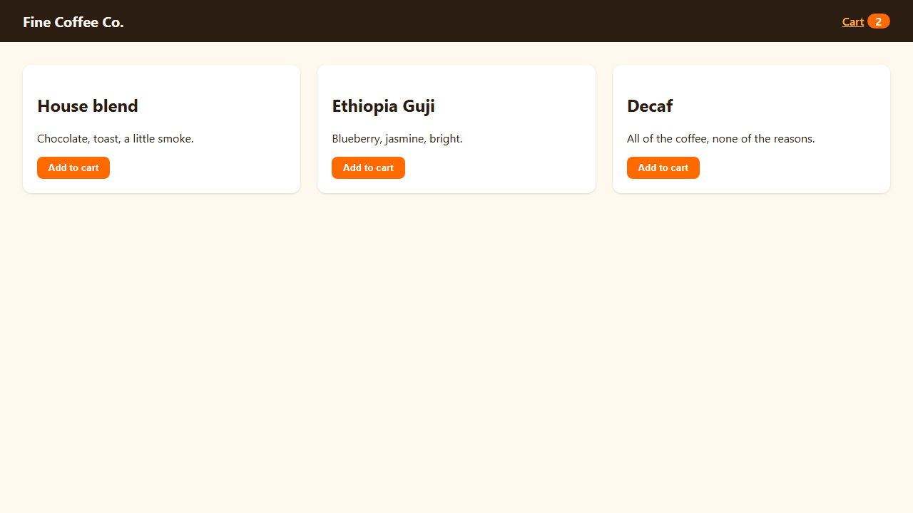
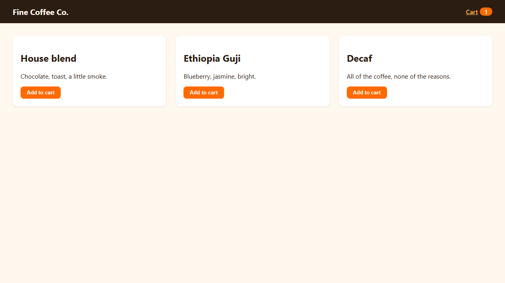

<p align="center">
  
</p>

<p align="center">
  <b>Your coding agent says "✅ Done" while your app is on fire.</b><br>
  thisisfine turns every behaviour you said <i>yes</i> to into a locked, proven browser check,<br>
  and won't let Claude finish a turn that breaks one.
</p>

<p align="center">
  <a href="#install">Install</a> ·
  <a href="#the-30-second-story">The 30-second story</a> ·
  <a href="#how-it-works">How it works</a> ·
  <a href="#what-it-cant-do">What it can't do</a> ·
  <a href="#faq">FAQ</a>
</p>

---

It worked yesterday. You checked it yourself and told Claude "perfect". Today Claude tidied up some code, and the thing you checked is quietly broken. Nobody noticed, because the only record that it ever worked was one word in a chat that's long gone.

thisisfine keeps that word. When you say yes to a behaviour, it becomes a **promise**: one sentence you agreed with, plus one Playwright check that proves it in a real browser. Before Claude can end a turn, every promise is checked. If one is broken, Claude is sent back to fix the app, with your own words quoted back to it.

## The 30-second story

This is a real run of the [example shop](examples/cart), the same steps the [end-to-end test](test/e2e.test.ts) replays in a real browser.

**1. You ask for a cart badge. Claude builds it, writes a check, and thisisfine proves the check can actually fail:**

```
✔ passes now ✔ fails on HEAD (app still boots)

Lock in promise #1 "Adding a coffee twice shows 2 on the cart badge"? ✔ passes now ✔ fails on HEAD (app still boots)
Reply y to confirm, anything else to skip.
```

**2. You reply `y, perfect`.**

```
🔒 Locked promise #1 "Adding a coffee twice shows 2 on the cart badge".
```

**3. Every turn after that ends with:**

```
☕ This is fine. 1/1 promises kept.
```

**4. Weeks later you ask for "a small cleanup of the cart code". Claude counts distinct products instead of items, which looks reasonable and is wrong. Claude tries to stop, and can't:**

```
🔥 This is NOT fine. You broke promise #1 "Adding a coffee twice shows 2 on the cart badge".
   The human confirmed it on Oct 4: "y, perfect"
   Check: .thisisfine/checks/1-cart-badge.spec.ts
   Failure:
     Error: expect(locator).toHaveText(expected) failed
     Locator:  getByTestId('cart-count')
     Expected: "2"
     Received: "1"
   Screenshot: .thisisfine/runs/…/test-failed-1.png

Fix the app so #1 holds again. Do not edit the checks, the ledger, or the config.
```

<table>
  <tr>
    <th>When you said yes</th>
    <th>After the "cleanup"</th>
  </tr>
  <tr>
    <td></td>
    <td></td>
  </tr>
</table>

**5. Claude fixes the app, not the check, and you get your coffee back:** `☕ This is fine. 1/1 promises kept.`

If Claude tries to edit the check instead, it's refused before the edit happens:

```
thisisfine: this check is promise #1 "Adding a coffee twice shows 2 on the cart badge", which the human locked.
Fix the app, not the check.
```

## Install

You need [Claude Code](https://claude.com/claude-code), Node 22.18 or newer, git, and a web app that starts with one command.

In Claude Code:

```
/plugin marketplace add dadwritestech/thisisfine
/plugin install thisisfine@thisisfine
```

Then, in your project:

```
/promise the cart badge shows how many items are in the cart
```

The first `/promise` sets up `.thisisfine/` in your repo and installs Playwright *into that folder* (your own `package.json` is untouched). Commit `.thisisfine/` so your promises travel with the code.

You don't have to type `/promise`. When you tell Claude something works ("works!", "perfect", "lgtm"), thisisfine reminds it to offer a promise. That happens at most once every five prompts, so it won't nag.

## How it works

```
 you: "perfect"  ──▶  Claude writes a check  ──▶  thisisfine proves it  ──▶  you: "y"  ──▶  🔒 locked
                                                  passes now,                              runs before
                                                  fails without the change                 every stop
```

1. **A promise is one sentence and one check.** The sentence is about something a user can see ("Logged-out visitors are sent to /login"), not how it's built. The check is a black-box [Playwright](https://playwright.dev) test in `.thisisfine/checks/`.
2. **thisisfine proves the check, not Claude.** It starts your app and runs the check on the code as it is now: it must pass on the first try. Then it runs the check on a version *without* the change, either the previous commit or a temporary copy with a small "sabotage" patch applied. The check must fail there while the app still boots. A check that can't fail is labelled 🟡 *unproven*, so you know it's weaker.
3. **Only you can lock it.** Your reply goes through a Claude Code hook, not through Claude. A whole-message "yes" (`y`, `yes`, `ok`, `lock it`, `y, perfect`, `👍`, `haan`, …) locks the promise. Anything else, like "yes but make it blue", skips it. thisisfine records your exact words and signs the record with a key that lives outside the repo.
4. **Every stop is a gate.** When Claude tries to end a turn, thisisfine starts the app once and runs every promise. If they all pass, Claude stops with `☕ This is fine.` If one fails, Claude is sent back with the sentence, your words, the assertion, and a screenshot. Nothing changed since the last green run? It doesn't run anything.
5. **Changing your mind is allowed, out loud.** If you really do want the behaviour to change, `/retire 3 we're dropping the badge` asks you to confirm, and only your `y` retires it. Claude is told to ask for this, not to route around a promise.

Three slash commands: `/promise <sentence>`, `/promises` (list them), `/retire <n> <why>`.

## For vibecoders

You don't need to know what a test is. You say "perfect" when something works, and Claude asks if you want to lock it in. From then on, if Claude breaks it, Claude finds out before you do, and has to fix it before it's allowed to say it's done. The messages are in plain English and quote what you said.

## For developers

- **Zero runtime dependencies.** The plugin is plain TypeScript run by Node's built-in type stripping. Playwright is pinned and installed into `.thisisfine/` only.
- **Black-box checks.** Checks can't import your code. They drive a real browser against your app on a free port (`PORT` is set, and `{port}` in the start command is replaced). Next.js and Vite are detected; anything else uses your `dev` or `start` script. Edit `.thisisfine/config.json` to change it.
- **Fast when nothing changed.** The gate hashes the working tree (tracked and untracked files, respecting `.gitignore`) and skips the run when it matches the last green tree. On the example shop, a passing gate takes about 1.3 s and proving a new promise about 13 s.
- **Flaky isn't failing.** The gate retries once. A check that passes on retry is reported as flaky and doesn't block. Proving a promise allows no retries, so a flaky check is refused at the door.
- **The same CLI Claude uses** is yours too: `status`, `check`, `verify`, `restore`, and more. Run `node <path-to-plugin>/bin/thisisfine.mjs --help`, or just ask Claude to run it.

## For team leads

- **Promises live in git.** `.thisisfine/promises.jsonl` is an append-only ledger: who agreed to what, when, in their own words, and whether the check was proven. It shows up in PR diffs like any other file.
- **Agent-written tests encode whatever the code does, bugs included.** Promises encode what a human looked at and agreed to. That's the one piece of ground truth in AI-assisted coding, and today it gets thrown away with the chat.
- **`thisisfine verify`** audits every lock: the signature, the check file's hash, and whether Claude Code's own transcript shows a person (not a tool) typing those exact words.

## What it can't do

thisisfine can't stop an agent that is determined to cheat. It makes cheating loud.

- **Tamper-evident, not tamper-proof.** Each lock is HMAC-signed with a key in `~/.thisisfine/`, and mirrored there too. If a locked check, the ledger, or the config is changed or deleted, the next stop is blocked until `thisisfine restore` puts back exactly what you confirmed. The guard that refuses edits up front is a speed bump. Shell commands can be written in endless ways, and it only catches the common ones.
- **Signatures are per machine.** The key never leaves your home directory, so a teammate's machine can read your promises and run them, but can't verify your signatures. Cross-machine verification is future work.
- **Claude Code and web apps only, for now.** Other agents (Codex, Cursor, pi) and non-browser checks are out of scope for v0.
- **It's only as good as the check.** A promise proves the check can fail when the behaviour is gone. It doesn't prove the check covers everything you had in mind. That's why the sentence is short, and why a person has to say yes.
- **Your app runs in your folder.** If a check clicks Save, it really saves, before every stop. `propose` names any project file the app wrote while the check ran, so you can point `start` at a scratch copy before you say yes. (We learned this the hard way: on a real app, a theme check rewrote `config.json`, and that saved setting later made the check pass with the feature broken.)
- **Not on npm yet.** Install it as a Claude Code plugin. A standalone `npx thisisfine` needs a build step that doesn't exist yet.

## FAQ

**Why not just ask Claude to write tests?**
Because Claude writes tests for the code it wrote, and can edit them when they get in the way. A promise starts from you saying yes, is proven to fail without the behaviour, and is locked against edits.

**How is this different from TestSprite or Shiplight?**
They generate and maintain tests for you. TestSprite saves the behaviours its agent has verified. Shiplight's tests repair themselves as the app changes. thisisfine only locks what a *person* confirmed, and deliberately never repairs a failing check: a failure means "go fix the app", not "update the test".

**And nocap, trust-issues, agent-guard, or Kvitansiya?**
Those watch *how* the agent works: skipped tests, weakened asserts, claims of "tests pass" without running them, or checking the agent's claimed result at the end of a session. They protect tests that already exist. thisisfine creates the checks from your confirmations and enforces them at every stop. They complement each other well.

**Will it slow Claude down?**
A turn that changed nothing costs nothing. A turn that changed code costs one app boot plus your checks, about a second for the example shop. A failing check takes longer (it waits for the assertion, then retries once), but that's the turn you wanted stopped.

**What if a check is flaky or the app won't start?**
Flaky checks warn and don't block. If the app can't start, Claude is blocked with the start error, because "couldn't check" isn't "fine". If the same block happens three times in a row, thisisfine lets Claude stop and hands the decision to you, so you're never stuck in a loop.

**Why the name?**
It's the face every coding agent makes while it reports success from inside a burning building. The phrase comes from KC Green's comic *On Fire*. thisisfine isn't affiliated with it, and the art here is original.


## Contributing

```bash
npm install
npm test
```

```bash
npm run typecheck
```

The end-to-end test installs Playwright and drives a real browser through the whole story above. It's opt-in:

```bash
THISISFINE_E2E=1 npm run test:e2e
```

## License

[MIT](LICENSE)
